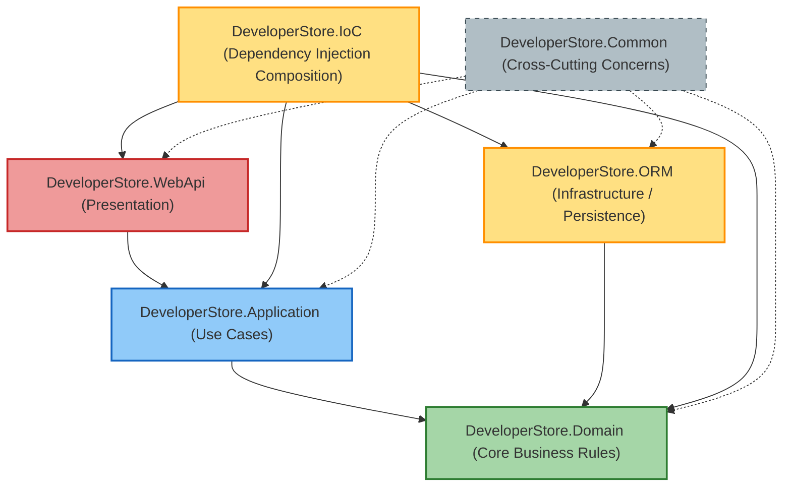

# DeveloperStore Sales API

[](https://github.com/JailtonJunior94/DeveloperStore/actions/workflows/ci.yml)


API de vendas construída para o teste técnico da DeveloperStore, com foco em robustez, DDD, validação semântica, contratos HTTP consistentes e modelagem inspirada em `Domain Modeling Made Functional`.

Repositório público: `https://github.com/JailtonJunior94/DeveloperStore`

## O que foi construído

Foi implementada uma API completa para gerenciamento de vendas, cobrindo:

- criação de venda
- consulta de venda por id
- listagem paginada com filtros e ordenação
- atualização de venda
- cancelamento lógico de venda
- cancelamento de item de venda
- publicação de eventos de domínio via log

Cada venda armazena:

- número da venda
- data da venda
- cliente
- filial
- itens vendidos
- quantidade por item
- preço unitário
- desconto aplicado
- total por item
- total consolidado da venda
- status da venda

## Escopo implementado

O escopo implementado neste repositório é `Sales API`.

Isso significa que a solução entregue cobre o domínio de vendas e suas evidências técnicas correspondentes:

- domínio de vendas
- endpoints de vendas
- persistência de vendas
- testes de vendas

Arquivos em `.doc` que descrevem `auth`, `users`, `products` e `carts` devem ser lidos como documentação de referência mais ampla da plataforma, não como prova automática de que esses módulos existem neste repositório.

## Como interpretar prontidão e evidência

Neste projeto, uma afirmação de prontidão só é considerada válida quando existe evidência objetiva executada sobre o estado atual do código.

Na prática, isso significa:

- build limpo
- testes relevantes verdes
- prova em PostgreSQL real para comportamento sensível a persistência
- documentação coerente com o comportamento efetivamente implementado

Teste em memória ajuda, mas não é prova suficiente para consultas, ordenação, filtros, tradução de LINQ, constraints ou migrations.

## Objetivo deste projeto no teste técnico

Este projeto foi desenhado para demonstrar:

- domínio explícito e semântico, evitando obsessão por tipos primitivos no núcleo do negócio
- separação clara entre `Domain`, `Application`, `ORM`, `IoC`, `Common` e `WebApi`
- validação fail-fast com retorno de lista semântica de erros para o cliente
- regras de desconto implementadas no domínio, não espalhadas em controllers ou infraestrutura
- aderência forte a testes automatizados em múltiplos níveis
- prova real com PostgreSQL, e não apenas testes em memória

## Stack utilizada

- `.NET 10`
- `C# 14`
- `ASP.NET Core Web API`
- `MediatR`
- `FluentValidation`
- `Entity Framework Core`
- `PostgreSQL`
- `xUnit`
- `FluentAssertions`
- `NSubstitute`
- `Serilog`

## Arquitetura

### Visual Architecture & Dependency Flow



### Directory Tree Structure

```text
.
├── src
│   ├── DeveloperStore.Domain
│   ├── DeveloperStore.Application
│   ├── DeveloperStore.ORM
│   ├── DeveloperStore.IoC
│   ├── DeveloperStore.Common
│   └── DeveloperStore.WebApi
├── tests
│   ├── DeveloperStore.Unit
│   ├── DeveloperStore.Integration
│   ├── DeveloperStore.Functional
│   └── DeveloperStore.Postgres
├── scripts
└── README.md
```

### Resumo das camadas

- `DeveloperStore.Domain`: regras de negócio, aggregate `Sale`, entidades, value objects, eventos e exceções de domínio.
- `DeveloperStore.Application`: comandos, queries, handlers, DTOs e validações de aplicação.
- `DeveloperStore.ORM`: `DbContext`, mappings e implementação do repositório.
- `DeveloperStore.IoC`: composição das dependências.
- `DeveloperStore.Common`: validação, logging e health checks.
- `DeveloperStore.WebApi`: controllers, middleware, contrato HTTP e bootstrap da API.

## Modelagem de domínio

O agregado principal é `Sale`.

Conceitos semânticos importantes foram modelados com tipos dedicados, por exemplo:

- `SaleId`
- `SaleItemId`
- `SaleNumber`
- `SoldAt`
- `Money`
- `ItemQuantity`
- `DiscountRate`
- `CustomerReference`
- `BranchReference`
- `ProductReference`

Essa modelagem reduz ambiguidade e concentra invariantes no lugar correto.

## Regras de negócio implementadas

- compras com `1` a `3` unidades idênticas recebem `0%` de desconto
- compras com `4` a `9` unidades idênticas recebem `10%` de desconto
- compras com `10` a `20` unidades idênticas recebem `20%` de desconto
- não é permitido vender mais de `20` unidades do mesmo produto
- vendas canceladas não podem ser alteradas
- cancelamento de venda cancela logicamente todos os itens
- cancelamento de item recalcula o total da venda

## Eventos de domínio implementados

Os eventos são publicados in-process e registrados em log:

- `SaleCreated`
- `SaleModified`
- `SaleCancelled`
- `ItemCancelled`

## Contrato da API

### Endpoints

- `POST /api/sales`
- `GET /api/sales/{id}`
- `GET /api/sales`
- `PUT /api/sales/{id}`
- `DELETE /api/sales/{id}`
- `POST /api/sales/{saleId}/items/{itemId}/cancel`

### Paginação

- `_page`: padrão `1`
- `_size`: padrão `10`

### Ordenação

Campos suportados em `_order`:

- `saleNumber`
- `soldAt`
- `customerName`
- `branchName`
- `totalAmount`
- `status`
- `itemCount`

Exemplo:

```bash
GET /api/sales?_page=1&_size=10&_order=soldAt desc, saleNumber asc
```

### Filtros suportados

- `saleNumber`
- `customerName`
- `branchName`
- `status`
- `_minSoldAt`
- `_maxSoldAt`

Compatibilidade temporária:

- `customer` continua aceito como alias legado de `customerName`
- `branch` continua aceito como alias legado de `branchName`

### Semântica de filtros de texto

- `saleNumber=SALE-123`: match exato
- `saleNumber=SALE*`: prefixo
- `customerName=*Silva`: sufixo
- `branchName=*Center*`: contains

## Erros da API

A API retorna erros semânticos com lista de detalhes para facilitar tratamento no cliente.

Exemplo:

```json
{
  "type": "validation_failed",
  "error": "Request validation failed",
  "detail": "One or more request values are invalid.",
  "status": 422,
  "traceId": "00-...",
  "errors": [
    {
      "code": "sale_number_required",
      "field": "SaleNumber",
      "message": "saleNumber is required"
    }
  ]
}
```

## Como executar

### Pré-requisitos

- `.NET SDK 10`
- `Docker`
- `Docker Compose`

## Passo a passo com Docker

### 1. Suba a infraestrutura e a API

```bash
docker compose up --build
```

### 2. Acesse a aplicação

- API: `http://localhost:8080`
- Swagger: `http://localhost:8080/swagger`
- Health: `http://localhost:8080/health`

### 3. Observação importante

No ambiente Docker, as migrations são aplicadas no startup porque `Database__ApplyMigrationsOnStartup=true` está configurado no compose.

## Passo a passo sem Docker

### 1. Suba um PostgreSQL local

Você precisa de uma instância acessível localmente.

### 2. Configure a connection string

Exemplo:

```bash
export ConnectionStrings__DefaultConnection="Host=localhost;Port=5432;Database=developerstore;Username=developerstore_app;Password=developerstore_local_only"
```

### 3. Escolha se quer aplicar migration automaticamente

Por padrão, a API não aplica migrations automaticamente.

Para habilitar:

```bash
export Database__ApplyMigrationsOnStartup=true
```

### 4. Rode a API

```bash
dotnet run --project src/DeveloperStore.WebApi/DeveloperStore.WebApi.csproj
```

## Como aplicar migrations manualmente

```bash
dotnet tool run dotnet-ef database update \
  --project src/DeveloperStore.ORM/DeveloperStore.ORM.csproj \
  --startup-project src/DeveloperStore.WebApi/DeveloperStore.WebApi.csproj
```

## Como testar

### Testes unitários

Validam regras de domínio e handlers isolados.

```bash
dotnet test tests/DeveloperStore.Unit/DeveloperStore.Unit.csproj --no-restore
```

### Testes de integração

Validam o repositório e consultas em nível de infraestrutura.

```bash
dotnet test tests/DeveloperStore.Integration/DeveloperStore.Integration.csproj --no-restore
```

### Testes funcionais

Validam o contrato HTTP da API.

```bash
dotnet test tests/DeveloperStore.Functional/DeveloperStore.Functional.csproj --no-restore
```

### Prova real com PostgreSQL

Sobe um PostgreSQL via Docker, aplica migrations e roda a suíte dedicada ao banco real.

```bash
./scripts/validate-postgres.sh
```

### Formatter

```bash
dotnet format DeveloperStore.slnx --verify-no-changes
```

## O que os testes comprovam

- regras de desconto
- limite máximo de `20` unidades por produto
- cálculo de total por item e total da venda
- validação semântica com payload de erro estruturado
- persistência real em PostgreSQL
- listagem com paginação, ordenação e filtros
- cancelamento de venda e cancelamento de item

## Evidências executadas na entrega

As seguintes validações são as evidências principais de que a solução está operacional no escopo de `sales`:

```bash
dotnet build DeveloperStore.slnx --no-restore
dotnet test tests/DeveloperStore.Unit/DeveloperStore.Unit.csproj --no-restore
dotnet test tests/DeveloperStore.Integration/DeveloperStore.Integration.csproj --no-restore
dotnet test tests/DeveloperStore.Functional/DeveloperStore.Functional.csproj --no-restore
./scripts/validate-postgres.sh
dotnet format DeveloperStore.slnx --verify-no-changes
```

## Exemplo de criação de venda

```json
{
  "saleNumber": "SALE-301",
  "soldAt": "2026-06-23T12:00:00Z",
  "customerExternalId": "customer-1",
  "customerName": "Jane Doe",
  "branchExternalId": "branch-1",
  "branchName": "Central",
  "items": [
    {
      "productExternalId": "product-1",
      "productName": "Product 1",
      "quantity": 4,
      "unitPrice": 10.0
    }
  ]
}
```

## Health checks

- `GET /health/live`
- `GET /health/ready`
- `GET /health`

## Observações relevantes para a avaliação

- o projeto foi conduzido com foco em `Sales API`
- o domínio foi priorizado sobre conveniência de ORM
- há validação semântica em borda e invariantes no núcleo do domínio
- a solução possui evidência automatizada em memória e em banco real
- a documentação foi atualizada para refletir o comportamento efetivamente implementado
- aderência literal a toda a pasta `.doc` não deve ser inferida sem confronto específico com cada contrato e com o escopo material deste repositório
